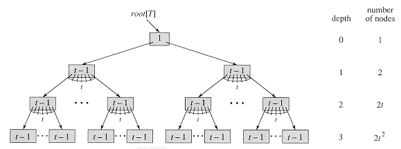

# B-Trees

[illustration](https://www.baeldung.com/cs/b-tree-data-structure)

> Used to store data in disks efficiently to reduce as much as possible disk-read operations and to operate on data using memory, **mostly used in databases.**
> 

> The idea is that most tree operations are O(h) where h is the height of the tree. But if we are saving data on the disk that means that we would have to access the disk h times which is way slower than accessing data on memory. so what B-tree does is make the tree wide rather than tall which will make it that we would have to search for more keys in a specific node but that is an operation done on the node when it’s retrieved from disk to memory which is way faster than reading more nodes from disk. and usually node size is equal to the disk block size so that reading a node doesn’t require more than one disk-read operation.
> 

### Minimum degree ( t ) , t ≥ 2

- Defines the minimum number of **children** of an internal node other than the root
- Every node except leaf-nodes has at least **t children**.
- Every node except root has at least **t-1** **keys**.
- All nodes have a **max** of **2t-1** keys.
- A node is *full* if it contains exactly 2*t*-1 keys.

---

- The child between two keys k1 and k2 contains all keys in the range from k1 and k2.
- B-Tree **grows and shrinks from the root**
    - which is unlike BSTs which grow downward and also shrink from downward.
- **Insertion** of a Node in B-Tree happens only at **Leaf Node**.
    
    but if it has to **grow** then its done from the **root**.
    
- Only way to grow tree ( increase height ) is by **splitting nodes.**

---

$$
h \leq log_t\frac{n+1}{2}
$$

- has at least ${2t}^{h-1}$ nodes at depth h.
- by increasing t we reduce h and so reduce number of disk-access operations.

---

| Operation | Time complexity |
| --- | --- |
| Search | O(log h) |
| Insertion | O(log h) |
| Deletion | O(log h) |

| Space complexity | O(n)

# Searching

**Search(node, k) : value || null**

1. starting from i=0 keep comparing k with node.keys[i] if k is larger >> i++
2. After getting i, check if the key matches with node.keys[i] >> thats it, key found, return value[i]
3. if it doesn’t match >> search(node.children[i])

# Insertion

- just like BST traverse to the insertion location with one addition is that never traverse a full node,  if we encounter a full node, split that node
- with this we can assure that when adding a new key its never added to a full node so we can simply insert it into node.

**Insert(k, v) : void**

1. if the tree is empty, create root node
2. if the root node is full, split root node into two nodes around median and create a new root node with the median key and with the 2 nodes from splitting as its children.
3. traverse the tree starting from the root until you get to a leaf node but before moving to a child node, if that child node is full >> split that node around median.
4. When we get to the leaf node, simply add <k, v> to node.

*and at any point if we encounter the key we are trying to add, just return.*

# Deletion

- Just like what we did with insertion  when we never traverse into a full node, when deleting never traverse into a minimal node (node.NumOfKeys = t-1), because if we delete from a minimal node that will violate b-tree properties.

**Delete(node, k) : boolean**

*this function assumes that (node) is never minimal since we can’t step into a minimal node.*

1. if k is not found in node:
    1. node is leaf, so k doesn’t exist in the tree return **false**.
    2. node is internal:
        1. if next node is not minimal, Delete(next, k)
        2. if next node is minimal
            1. if the sibling left node or right node of next node is non minimal borrow a key from that node. 
            2. if both sibling is minimal, merge them both with node.key[i] at the middle of the 2 nodes key.    [left, K, right]
2. if k found in node:
    1. node is leaf, simply delete it and return **true**
    2. node is internal:
        1. if the child that precedes key is not minimal, get the **predecessor** of that key, swap it with target key, and delete target key from leaf.
        2. (symmetric to i) if the child that follows key is not minimal, get the **successor** of that key, swap it with target key, and delete target key from leaf.
        3. both children that precede or follow the key are minimal, in that case merge both including the target key in the middle and then recursively delete                    key.
